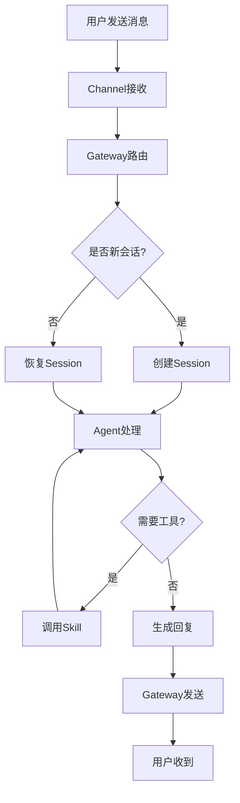

# OpenClaw 完全指南

> 一个开源的多通道 AI 助手网关，让你可以从任意聊天软件与 AI 对话

## 什么是 OpenClaw？

OpenClaw 是一个**自托管的 AI 助手网关**，它连接了你的聊天应用（WhatsApp、Telegram、Discord、iMessage 等）到 AI 编程助手。

### 核心特点

| 特性 | 说明 |
|------|------|
| 自托管 | 运行在你的服务器或电脑上，数据完全自主可控 |
| 多通道 | 一个 Gateway 同时支持多个聊天平台 |
| Agent 原生 | 为 AI 编程助手设计，支持工具调用、会话管理、记忆、多 Agent 路由 |
| 开源免费 | MIT 许可，社区驱动 |

---

## 技术原理详解

### 1. 架构设计

OpenClaw 采用**网关模式（Gateway Pattern）**，所有消息都经过 Gateway 中转：

```
用户消息 → 聊天平台 → Gateway → AI Agent → 处理 → Gateway → 聊天平台 → 用户
```

**核心组件：**

| 组件 | 作用 |
|------|------|
| Gateway | 消息路由、会话管理、通道连接 |
| Agent | AI 对话处理、工具调用、记忆管理 |
| Channel Plugins | 各平台协议适配（QQ/Telegram/Discord 等） |
| Skills | 扩展工具能力（图像生成、天气查询等） |

### 2. 消息流转流程



### 3. 会话管理机制

- **Session（会话）**：一次对话上下文，包含历史消息、状态
- ** Isolated Session（隔离会话）**：每个对话独立隔离，互不干扰
- **持久化**：会话状态保存在内存，支持热恢复

### 4. 工具调用（Tool Use）

Agent 可调用 Skills 扩展能力：

1. Agent 分析用户请求
2. 识别需要使用的工具
3. 调用 Skill 执行
4. 接收结果并整合回复

### 5. 记忆系统

```
┌─────────────────────────────────────┐
│           记忆层次                   │
├─────────────────────────────────────┤
│ Session 记忆 (当前对话)              │
├─────────────────────────────────────┤
│ Daily 记忆 (memory/YYYY-MM-DD.md)   │
├─────────────────────────────────────┤
│ 长期记忆 (MEMORY.md)                 │
└─────────────────────────────────────┘
```

---

## 系统架构

```
┌─────────────┐     ┌─────────────┐
│  聊天应用    │     │   移动端    │
│ WhatsApp   │     │  iOS/Android│
│ Telegram   │     │   (节点)     │
│ Discord    │────▶│             │
│ iMessage   │     │  相机/屏幕   │
└─────────────┘     └─────────────┘
                           │
                           ▼
                    ┌─────────────┐
                    │  Gateway    │
                    │   网关      │
                    └─────────────┘
                           │
           ┌───────────────┼───────────────┐
           ▼               ▼               ▼
      ┌─────────┐    ┌─────────┐    ┌─────────┐
      │ AI Agent│    │  CLI    │    │  Web   │
      │  (Pi)   │    │  命令行  │    │ 控制台  │
      └─────────┘    └─────────┘    └─────────┘
```

---

## 实际使用场景

### 场景 1：个人 AI 助手

**需求**：在微信/QQ 上随时召唤 AI 助手

**实现**：
- 配置 QQ Bot / 微信插件
- 设置默认 Agent
- 随时发送消息获取 AI 帮助

**示例对话**：
```
用户：帮我查下明天深圳天气
助手：明天深圳天气晴，气温22-28°C，适合外出～
```

### 场景 2：家庭 AI 管家的

**需求**：家庭成员共用一个 AI 助手

**实现**：
- 配置群聊机器人
- 设置多个 Agent（问答/提醒/翻译）
- 家庭成员可直接在群里提问

### 场景 3：AI 编程助手

**需求**：在 Discord 团队协作中接入 AI 编程助手

**实现**：
- 配置 Discord 通道
- 启用代码相关 Skills
- 团队成员可直接 @AI 提问

### 场景 4：自动化工作流

**需求**：定时执行任务并推送结果

**实现**：
- 配置 cron 定时任务
- 设置自动提醒（天气、日程、股票）
- 每天自动推送资讯

### 场景 5：内容创作助手

**需求**：快速生成图片/视频/音乐

**实现**：
- 安装 Media Skills（图像/视频/音乐生成）
- 发送描述即可生成内容
- 支持图生图、视频延展等高级功能

### 场景 6：知识库问答

**需求**：基于私有文档的问答系统

**实现**：
- 将文档导入 Obsidian
- 配置向量嵌入（可选）
- Agent 可引用知识库内容回答

---

## 安装方法

### 环境要求

- Node.js 22+
- npm 或 pnpm
- API Key（支持 MiniMax、OpenAI 等）

### 安装步骤

#### 1. 安装 OpenClaw

```bash
# 使用 pnpm 全局安装（推荐）
pnpm install -g openclaw

# 或使用 npm
npm install -g openclaw
```

#### 2. 启动 Gateway

```bash
openclaw gateway start
```

#### 3. 首次配置

```bash
# 运行配置向导
openclaw onboard
```

或直接编辑配置文件：

```bash
# 配置文件位置
~/.openclaw/config.yaml
```

#### 4. 配置 API Key

在 `~/.openclaw/.config/api-keys.json` 中配置：

```json
{
  "minimax": "your-api-key-here"
}
```

### Docker 部署（可选）

```yaml
version: '3.8'
services:
  openclaw:
    image: openclaw/openclaw
    ports:
      - "8080:8080"
    volumes:
      - ./data:/root/.openclaw
```

---

## 配置说明

### 配置文件结构

```
~/.openclaw/
├── config.yaml          # 主配置
├── .config/
│   ├── api-keys.json   # API 密钥
│   └── server.json     # 服务器配置
└── workspace/          # 工作空间
    ├── AGENTS.md       # Agent 配置
    ├── SOUL.md         # Agent 角色设定
    ├── USER.md         # 用户信息
    └── memory/         # 记忆文件
```

### 常用配置项

```yaml
# config.yaml 示例
channels:
  qqbot:
    enabled: true
  
  telegram:
    enabled: true
    bot_token: "xxx"

model: minimax-portal/MiniMax-M2.5
```

---

## 支持的通道

| 通道 | 状态 | 说明 |
|------|------|------|
| QQ Bot | ✅ | 支持私聊/群聊 |
| Telegram | ✅ | Bot 模式 |
| Discord | ✅ | |
| WhatsApp | ✅ | |
| iMessage | ✅ | 需要 macOS |
| 飞书 | ✅ | |
| Web | ✅ | 浏览器控制台 |

---

## 常用命令

```bash
# Gateway gateway start      # 启动
open 管理
openclawclaw gateway stop       # 停止
openclaw gateway restart    # 重启
openclaw gateway status     # 状态

# 会话管理
openclaw sessions list      # 列出会话
openclaw sessions kill      # 结束会话

# 节点管理
openclaw nodes list         # 列出已配对节点
```

---

## 技能 (Skills)

OpenClaw 支持扩展技能，常见内置技能：

| 技能 | 用途 |
|------|------|
| minimax-image-expert | AI 图像生成 |
| minimax-music-expert | AI 音乐生成 |
| minimax-video-expert | AI 视频生成 |
| weather | 天气查询 |
| obsidian-publisher | 笔记发布 |
| qqbot-cron | 定时提醒 |

### 安装新技能

```bash
clawhub install <skill-name>
```

---

## 移动端配对

OpenClaw 支持配对 iOS 和 Android 设备，获取更多能力：

- 📷 相机拍照/录像
- 📱 屏幕截图
- 🗣️ 语音交互
- 🖥️ Canvas 界面

---

## 进阶使用

### 1. 配置模型

支持多种模型提供商：

```yaml
model: minimax-portal/MiniMax-M2.5
# 或
model: anthropic/claude-sonnet-4-20250514
```

### 2. 自定义 Agent 角色

编辑 `SOUL.md` 自定义 Agent 性格和行为。

### 3. 记忆系统

- `MEMORY.md` - 长期记忆
- `memory/YYYY-MM-DD.md` - 每日记录

### 4. 定时任务

使用 cron 设置定时提醒：

```json
{
  "schedule": {
    "kind": "cron",
    "expr": "0 9 * * *",
    "tz": "Asia/Shanghai"
  }
}
```

---

## 故障排除

### Gateway 无法启动

```bash
# 检查端口占用
lsof -i:8080

# 查看日志
openclaw gateway status
```

### 消息发送失败

- 检查通道配置是否正确
- 确认 API Key 有效
- 查看 Gateway 日志

### 技能无法使用

```bash
# 重新安装技能
clawhub install <skill-name>
```

---

## 相关链接

- 官网：https://openclaw.ai
- 文档：https://docs.openclaw.ai
- GitHub：https://github.com/openclaw/openclaw
- Discord：https://discord.com/invite/clawd
- 技能市场：https://clawhub.com

---

*持续更新中...*
